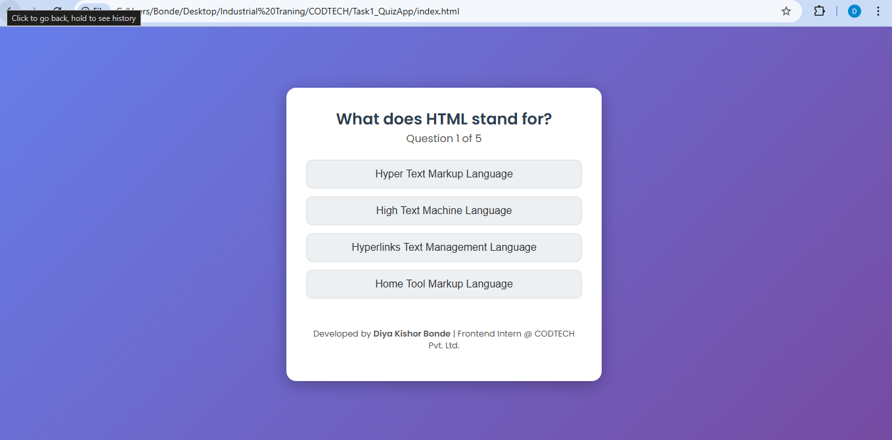

# CODTECH Internship - Task 1: Quiz App

### Project Description
An interactive quiz application built using **HTML**, **CSS**, and **JavaScript**.  
Users can answer multiple-choice questions, receive **instant feedback**, and view their **final score**.  
The app is fully **responsive** and works smoothly on desktop, tablet, and mobile devices.

### Features
- Attractive and modern responsive UI  
- Instant correct/wrong answer highlighting  
- Dynamic question loading  
- Next, Submit, and Restart functionality  
- Clean and readable code with minimal comments for clarity  

### Technologies Used
- HTML5  
- CSS3  
- JavaScript (ES6)

### Developer
**Diya Kishor Bonde**  
Frontend Developer Intern at **CODTECH Pvt. Ltd.**

---

### Screenshots

#### Start Screen

#### Quiz Question Screen

#### Answer Selected / Feedback

#### Quiz Result / Score

#### Restart Quiz Option

### GitHub Repository Link
> https://github.com/DiyaBonde/CODTECH-Task1-QuizApp
