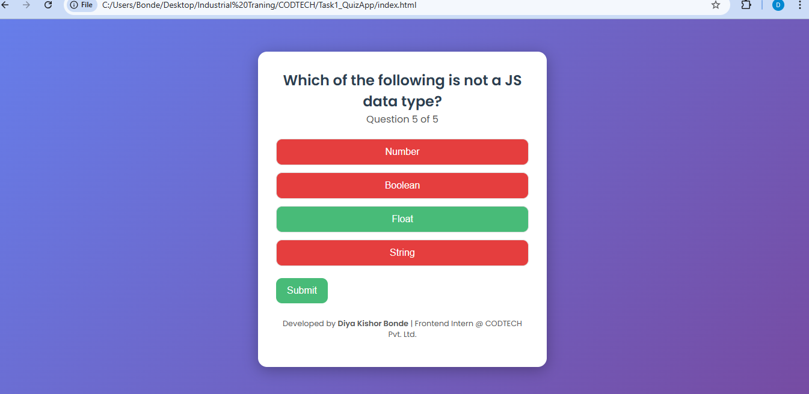

# CODTECH Internship - Task 1: Quiz App

## Overview
This project is developed as part of the CODTECH Internship Task 1.  
It is a **Quiz Application** built using **HTML, CSS, and JavaScript** that allows users to attempt a quiz, get instant feedback on answers, view their score, and restart the quiz.

---

## Features
- Display multiple-choice quiz questions.
- Provide **instant feedback** for each answer selected.
- Show **quiz results and score** at the end.
- Option to **restart the quiz** and try again.

---

## Screenshots

### Quiz Question Screen

### Answer Selected / Feedback

### Quiz Result / Score

### Restart Quiz Option

---

## Technologies Used
- **HTML5** – For the structure of the quiz application.
- **CSS3** – For styling and layout.
- **JavaScript** – For quiz logic, score calculation, and dynamic feedback.

---

git clone https://github.com/DiyaBonde/CODTECH-Task1-QuizApp.git
